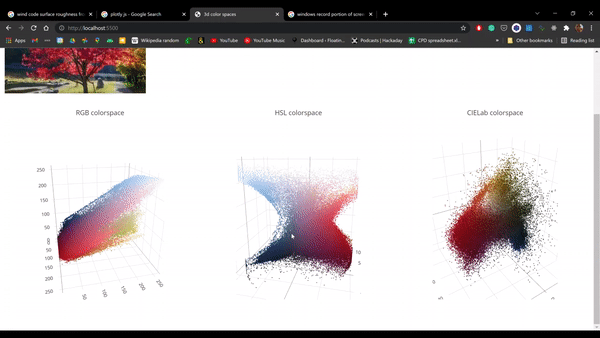

# 3d colour spaces

Vanilla Javascript experiment to visualise RGB, YSL and CIElab colourspaces in 3d. Loads pretty photo below. Not sure who to attribute this image to but [here is post on linkedin that got me interested](https://www.linkedin.com/posts/zeno-zoppi-70154b64_autumn-foliage-rhinoceros-activity-6858120283321077761-vWun) and shows 3d scatterplots for colourspaces.

Uses [plotly.js](https://plotly.com/javascript/) for the 3d scatter plots. For Pythonistas, try [Plot.ly Dash](https://plotly.com/dash/). 

Can be run in VSCode using [live server](https://marketplace.visualstudio.com/items?itemName=ritwickdey.LiveServer), defaults to http://localhost:5500 in browser.

Sources of the various colourspace conversions are commented in [colorspace.js](/colorspace.js). I was just the cook, not the chef!!!

**Warning** Processing step is s--l--o--w 🐌, so downsize images so they have < 1,000,000 pixels otherwise becomes unmanageable... 

...or write a better implementation!!!
